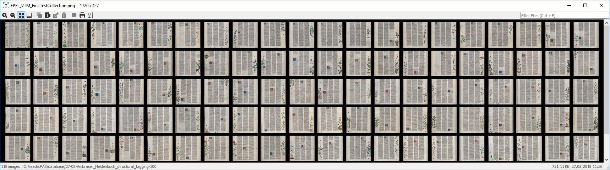
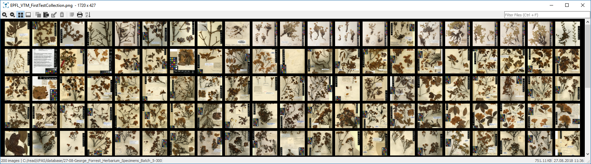
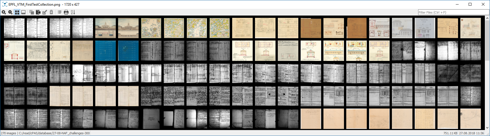
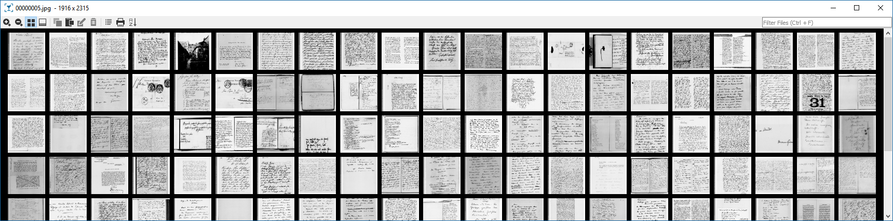
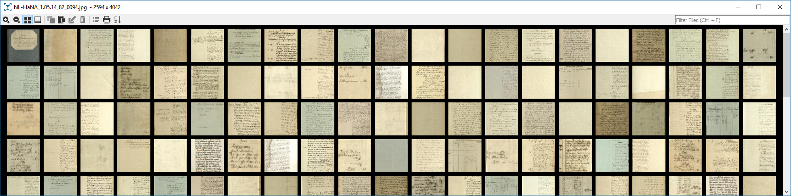
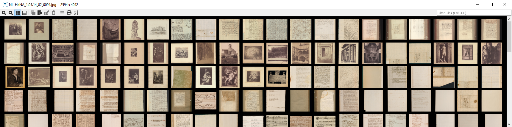
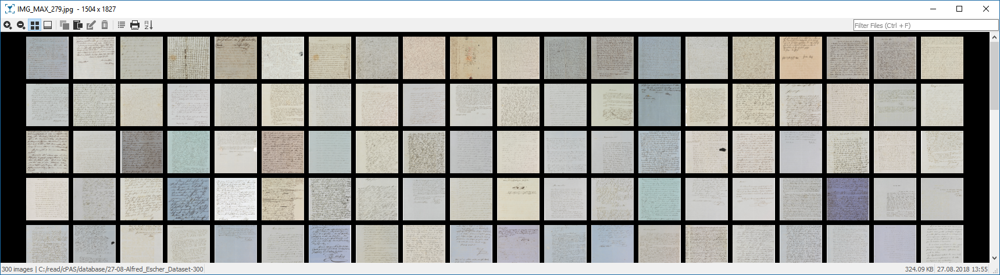
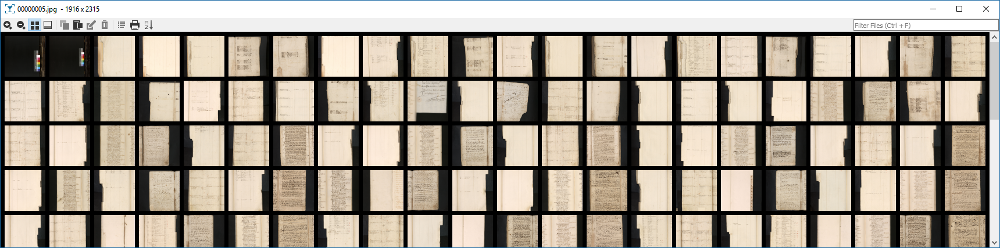
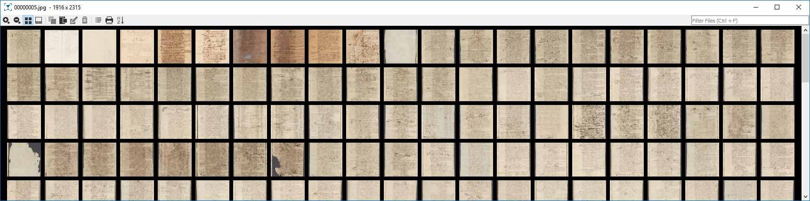
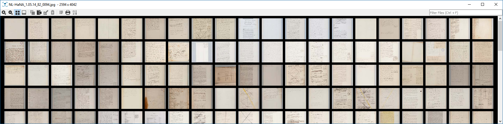

# cPAS

Competition on PAge Segmentation. This competition will facilitate research in page segmentation. An annotated database is collected from XX archives with XXX page images. The objective is to automatically locate and correctly label regions in document page images.

## ToC

- [Prerequisite](#prerequisite)
- [Database Creation](#database-creation)
  - [Annotation](#Annotation)
  - [Scripts](#Scripts)
  - [Discussion](#discussion)
- [Source Collection](#source-collection)
  - [Statistics](#statistics)
  - [Notes](#notes)
  - [Removed Sources](#removed-sources)

## Prerequisite

- python 3.x in your system path
- our [benchmarking script](https://github.com/TUWien/Benchmarking)

## Database Creation

### Annotation

- Handwritten text block
- Machine printed text block
- Image (Photo/Drawing/Figure)
- Seals
- Signatures
- Initials

### Scripts

- `cd` to the directory containing the [benchmarking script](https://github.com/TUWien/Benchmarking)
- Equalize the database with this script:

```bat
REM cPAS small
SET NUM_PAGES=800
SET SRC=\\carl\Read01\competition\cPAS\sources
SET DST=C:/READ/cPAS/
python lib\database\cdb.py --batch --flatcopy --outfile %DST%/logs/db-%DATE%-%NUM_PAGES%.txt --copyto %DST%/database/cPAS-%DATE%-%NUM_PAGES% %SRC% %NUM_PAGES%
```

### Discussion

- We are currently missing printed pages
- The label marginalia is not included since it has no visual feature

## Source Collection

- Ambraser_Heldenbuch_structural_tagging [118]
  - Initials
  - Decorations
  - Regions are tagged already
  - 16th century
- George_Forrest_Herbarium_Specimens_Batch_5 [200]
  - dry plants
  - color palettes
  - ~1905
- NAF_challenges [270]
  - Kadaster
  - Tables
  - Stamps
  - Architectural drawings
- StAM_Marburg_Grimm_SetP [18255]
  - BW
  - Images/Stamps
  - 1946
- Uni_Greifswald_4_Different_DocTypes [16306]
  - mainly homogeneous
  - only 555nd_Hs_7_edeldehis_702716863_tif_400_dpi has Initials
- unibas_e-Manuscripta [140418]
  - prints/images
  - heterogeneous

### Statistics

```bat
REM Ambraser_Heldenbuch_structural_tagging
python lib\database\cdb.py --batch --flatcopy --outfile C:/READ/cPAS/logs/db-300.txt --copyto C:/READ/cPAS/database/27-08-Ambraser_Heldenbuch_structural_tagging-300 \\carl\Read01\competition\cPAS\sources\Ambraser_Heldenbuch_structural_tagging 300

[118]    \\carl\Read01\competition\cPAS\sources\Ambraser_Heldenbuch_structural_tagging
I was crawling with 6 processes
I found 118 candidates in 2 dirs in 0 secs
WARNING: you asked for 300 but I only found 118 relevant files
```



```bat
REM George_Forrest_Herbarium_Specimens_Batch_5
python lib\database\cdb.py --outfile C:/READ/cPAS/logs/db-300.txt --copyto C:/READ/cPAS/database/27-08-George_Forrest_Herbarium_Specimens_Batch_5-300 \\carl\Read01\competition\cPAS\sources\George_Forrest_Herbarium_Specimens_Batch_5 300

[200]    \\carl\Read01\competition\cPAS\sources\George_Forrest_Herbarium_Specimens_Batch_5
I was crawling with 6 processes
I found 200 candidates in 2 dirs in 0 secs
WARNING: you asked for 300 but I only found 200 relevant files
200 lines written to C:/READ/cPAS/logs/db-300.txt
```



```bat
REM NAF_challenges
python lib\database\cdb.py --outfile C:/READ/cPAS/logs/db-300.txt --copyto C:/READ/cPAS/database/27-08-NAF_challenges-300 \\carl\Read01\competition\cPAS\sources\NAF_challenges 300

[270]    \\carl\Read01\competition\cPAS\sources\NAF_challenges
I was crawling with 6 processes
I found 270 candidates in 1 dirs in 0 secs
WARNING: you asked for 300 but I only found 270 relevant files
270 lines written to C:/READ/cPAS/logs/db-300.txt
```



```bat
REM StAM_Marburg_Grimm_SetP
python lib\database\cdb.py --outfile C:/READ/cPAS/logs/db-300.txt --copyto C:/READ/cPAS/database/27-08-Marburg-300 \\carl\Read01\ftp-ibk\StAM_Marburg_Grimm_SetP 300

I was crawling with 6 processes
I found 18255 candidates in 2489 dirs in 83 secs
300 lines written to C:/READ/cPAS/logs/db-300.txt
```



<details>
  <summary>More...</summary>
```bat
[2]      //carl/Read01/ftp-ibk/StAM_Marburg_Grimm_SetP/Br 4200-4201
[2]      //carl/Read01/ftp-ibk/StAM_Marburg_Grimm_SetP/Br 3814
[1]      //carl/Read01/ftp-ibk/StAM_Marburg_Grimm_SetP/Br 4931
[1]      //carl/Read01/ftp-ibk/StAM_Marburg_Grimm_SetP/Br 4202
[5]      //carl/Read01/ftp-ibk/StAM_Marburg_Grimm_SetP/Br 4932-4934
[2]      //carl/Read01/ftp-ibk/StAM_Marburg_Grimm_SetP/Br 401
[5]      //carl/Read01/ftp-ibk/StAM_Marburg_Grimm_SetP/Br 4639, 5757
[2]      //carl/Read01/ftp-ibk/StAM_Marburg_Grimm_SetP/Br 3816-3817
[1]      //carl/Read01/ftp-ibk/StAM_Marburg_Grimm_SetP/Br 4203
[1]      //carl/Read01/ftp-ibk/StAM_Marburg_Grimm_SetP/Br 5094
[3]      //carl/Read01/ftp-ibk/StAM_Marburg_Grimm_SetP/Br 4935-4938
[1]      //carl/Read01/ftp-ibk/StAM_Marburg_Grimm_SetP/Br 3818
[2]      //carl/Read01/ftp-ibk/StAM_Marburg_Grimm_SetP/Br 4204
[1]      //carl/Read01/ftp-ibk/StAM_Marburg_Grimm_SetP/Br 5096
[1]      //carl/Read01/ftp-ibk/StAM_Marburg_Grimm_SetP/Br 432
[2]      //carl/Read01/ftp-ibk/StAM_Marburg_Grimm_SetP/Br 3819-3820
[4]      //carl/Read01/ftp-ibk/StAM_Marburg_Grimm_SetP/Br 4641-4644
[...]
```

</details>

```bat
REM checking Uni_Greifswald_4_Different_DocTypes
python lib\database\cdb.py --outfile C:/READ/cPAS/logs/db-300.txt --copyto C:/READ/cPAS/database/27-08-Uni_Greifswald_4_Different_DocTypes-300 \\carl\Read01\ftp-ibk\Uni_Greifswald_4_Different_DocTypes 300

I was crawling with 6 processes
I found 16306 candidates in 78 dirs in 8 secs
300 lines written to C:/READ/cPAS/logs/db-300.txt
```



<details>
  <summary>More...</summary>

```bat
[192]    //carl/Read01/ftp-ibk/Uni_Greifswald_4_Different_DocTypes/Labores/UAG_0_1_Labores_Hbg_39_21_21
[465]    //carl/Read01/ftp-ibk/Uni_Greifswald_4_Different_DocTypes/Protokolle-Konzil/UAG_0_1_R_124_1900
[486]    //carl/Read01/ftp-ibk/Uni_Greifswald_4_Different_DocTypes/HS-UB/555nd_Hs_7_edeldehis_702716863_tif_400_dpi
[170]    //carl/Read01/ftp-ibk/Uni_Greifswald_4_Different_DocTypes/Labores/UAG_0_1_Labores_Hbg_39_9_9
[618]    //carl/Read01/ftp-ibk/Uni_Greifswald_4_Different_DocTypes/Rechnungsbuecher/UAG_0_1_R_2195_1909
[160]    //carl/Read01/ftp-ibk/Uni_Greifswald_4_Different_DocTypes/Rechnungsbuecher/UAG_0_1_St_1039_1740_tif
[172]    //carl/Read01/ftp-ibk/Uni_Greifswald_4_Different_DocTypes/HS-UB/555_Ms_11_Annalen_Kloster_Olivia_annaprmob_770333176_tif_400_dpi
[382]    //carl/Read01/ftp-ibk/Uni_Greifswald_4_Different_DocTypes/Protokolle-Konzil/UAG_0_1_R_125_1890
[626]    //carl/Read01/ftp-ibk/Uni_Greifswald_4_Different_DocTypes/Labores/UAG_0_1_Labores_R_434a_5_tif
[140]    //carl/Read01/ftp-ibk/Uni_Greifswald_4_Different_DocTypes/Rechnungsbuecher/UAG_1_1_St_1022_1721
[290]    //carl/Read01/ftp-ibk/Uni_Greifswald_4_Different_DocTypes/HS-UB/beccdea_555_Hs_667_tif
[443]    //carl/Read01/ftp-ibk/Uni_Greifswald_4_Different_DocTypes/Protokolle-Konzil/UAG_0_1_R_126_1885
[136]    //carl/Read01/ftp-ibk/Uni_Greifswald_4_Different_DocTypes/Rechnungsbuecher/UAG_1_1_St_1024_1722
[677]    //carl/Read01/ftp-ibk/Uni_Greifswald_4_Different_DocTypes/Labores/UAG_0_1_Labores_R_434_5_tif
[72]     //carl/Read01/ftp-ibk/Uni_Greifswald_4_Different_DocTypes/HS-UB/bescvoch_555_Ms_827_tif
[152]    //carl/Read01/ftp-ibk/Uni_Greifswald_4_Different_DocTypes/Rechnungsbuecher/UAG_1_1_St_1025_1723
[142]    //carl/Read01/ftp-ibk/Uni_Greifswald_4_Different_DocTypes/HS-UB/bugepome_734980140_tif_300_dpi
[609]    //carl/Read01/ftp-ibk/Uni_Greifswald_4_Different_DocTypes/Protokolle-Konzil/UAG_0_1_R_127_1868
[146]    //carl/Read01/ftp-ibk/Uni_Greifswald_4_Different_DocTypes/HS-UB/censcascp_555_Ms_697_tif
[154]    //carl/Read01/ftp-ibk/Uni_Greifswald_4_Different_DocTypes/Rechnungsbuecher/UAG_1_1_St_1026_1724
[283]    //carl/Read01/ftp-ibk/Uni_Greifswald_4_Different_DocTypes/Labores/UAG_0_1_Labores_R_450_20_tif
[158]    //carl/Read01/ftp-ibk/Uni_Greifswald_4_Different_DocTypes/Rechnungsbuecher/UAG_1_1_St_1027_1726
[270]    //carl/Read01/ftp-ibk/Uni_Greifswald_4_Different_DocTypes/Protokolle-Konzil/UAG_0_1_R_128_1850
[351]    //carl/Read01/ftp-ibk/Uni_Greifswald_4_Different_DocTypes/HS-UB/gebebuch_742392333_tif_400_dpi
[156]    //carl/Read01/ftp-ibk/Uni_Greifswald_4_Different_DocTypes/Rechnungsbuecher/UAG_1_1_St_1028_1727
[410]    //carl/Read01/ftp-ibk/Uni_Greifswald_4_Different_DocTypes/Protokolle-Konzil/UAG_0_1_R_131_1844
[724]    //carl/Read01/ftp-ibk/Uni_Greifswald_4_Different_DocTypes/HS-UB/kantchro_Ms26_tif
[160]    //carl/Read01/ftp-ibk/Uni_Greifswald_4_Different_DocTypes/Rechnungsbuecher/UAG_1_1_St_1029_1728
[402]    //carl/Read01/ftp-ibk/Uni_Greifswald_4_Different_DocTypes/HS-UB/neueveunv_555_Ms_253_tif
[156]    //carl/Read01/ftp-ibk/Uni_Greifswald_4_Different_DocTypes/Rechnungsbuecher/UAG_1_1_St_1029_1729
[686]    //carl/Read01/ftp-ibk/Uni_Greifswald_4_Different_DocTypes/Protokolle-Konzil/UAG_0_1_R_134_1860
[156]    //carl/Read01/ftp-ibk/Uni_Greifswald_4_Different_DocTypes/Rechnungsbuecher/UAG_1_1_St_1030_1730
[384]    //carl/Read01/ftp-ibk/Uni_Greifswald_4_Different_DocTypes/Protokolle-Konzil/UAG_0_1_R_135_1847
[168]    //carl/Read01/ftp-ibk/Uni_Greifswald_4_Different_DocTypes/Rechnungsbuecher/UAG_1_1_St_1032_1731
[880]    //carl/Read01/ftp-ibk/Uni_Greifswald_4_Different_DocTypes/HS-UB/pomebuiiu_Ms25_tif
[153]    //carl/Read01/ftp-ibk/Uni_Greifswald_4_Different_DocTypes/Rechnungsbuecher/UAG_1_1_St_1033_1732
[290]    //carl/Read01/ftp-ibk/Uni_Greifswald_4_Different_DocTypes/Protokolle-Konzil/UAG_0_1_St_690_1825
[166]    //carl/Read01/ftp-ibk/Uni_Greifswald_4_Different_DocTypes/Rechnungsbuecher/UAG_1_1_St_1034_1733
[60]     //carl/Read01/ftp-ibk/Uni_Greifswald_4_Different_DocTypes/Protokolle-Konzil/UAG_0_1_St_691_1827
[66]     //carl/Read01/ftp-ibk/Uni_Greifswald_4_Different_DocTypes/HS-UB/vergunrew_555_Ms_825_tif
[166]    //carl/Read01/ftp-ibk/Uni_Greifswald_4_Different_DocTypes/Rechnungsbuecher/UAG_1_1_St_1035_1735
[48]     //carl/Read01/ftp-ibk/Uni_Greifswald_4_Different_DocTypes/Protokolle-Konzil/UAG_0_1_St_695_1807
[166]    //carl/Read01/ftp-ibk/Uni_Greifswald_4_Different_DocTypes/Rechnungsbuecher/UAG_1_1_St_1036_1737
[202]    //carl/Read01/ftp-ibk/Uni_Greifswald_4_Different_DocTypes/Protokolle-Konzil/UAG_0_1_St_697_1807
[116]    //carl/Read01/ftp-ibk/Uni_Greifswald_4_Different_DocTypes/Protokolle-Konzil/UAG_0_1_St_698_1808
[154]    //carl/Read01/ftp-ibk/Uni_Greifswald_4_Different_DocTypes/Rechnungsbuecher/UAG_1_1_St_1037_1736
[140]    //carl/Read01/ftp-ibk/Uni_Greifswald_4_Different_DocTypes/Protokolle-Konzil/UAG_0_1_St_699_1808
[124]    //carl/Read01/ftp-ibk/Uni_Greifswald_4_Different_DocTypes/Protokolle-Konzil/UAG_0_1_St_700_1809
[166]    //carl/Read01/ftp-ibk/Uni_Greifswald_4_Different_DocTypes/Rechnungsbuecher/UAG_1_1_St_1038_1739
[122]    //carl/Read01/ftp-ibk/Uni_Greifswald_4_Different_DocTypes/Protokolle-Konzil/UAG_0_1_St_701_1809
[160]    //carl/Read01/ftp-ibk/Uni_Greifswald_4_Different_DocTypes/Rechnungsbuecher/UAG_1_1_St_1039_1740
[76]     //carl/Read01/ftp-ibk/Uni_Greifswald_4_Different_DocTypes/Protokolle-Konzil/UAG_0_1_St_702_1811
[125]    //carl/Read01/ftp-ibk/Uni_Greifswald_4_Different_DocTypes/Rechnungsbuecher/UAG_1_1_St_1075_1653
[82]     //carl/Read01/ftp-ibk/Uni_Greifswald_4_Different_DocTypes/Protokolle-Konzil/UAG_0_1_St_703_1810
[77]     //carl/Read01/ftp-ibk/Uni_Greifswald_4_Different_DocTypes/Rechnungsbuecher/UAG_1_1_St_1077_1664
[56]     //carl/Read01/ftp-ibk/Uni_Greifswald_4_Different_DocTypes/Protokolle-Konzil/UAG_0_1_St_704_1811
[64]     //carl/Read01/ftp-ibk/Uni_Greifswald_4_Different_DocTypes/Rechnungsbuecher/UAG_1_1_St_1083_1592
[56]     //carl/Read01/ftp-ibk/Uni_Greifswald_4_Different_DocTypes/Protokolle-Konzil/UAG_0_1_St_705_1811
[62]     //carl/Read01/ftp-ibk/Uni_Greifswald_4_Different_DocTypes/Protokolle-Konzil/UAG_0_1_St_706_1812
[96]     //carl/Read01/ftp-ibk/Uni_Greifswald_4_Different_DocTypes/Protokolle-Konzil/UAG_0_1_St_707_1779
[54]     //carl/Read01/ftp-ibk/Uni_Greifswald_4_Different_DocTypes/Protokolle-Konzil/UAG_0_1_St_707_1812
[100]    //carl/Read01/ftp-ibk/Uni_Greifswald_4_Different_DocTypes/Protokolle-Konzil/UAG_0_1_St_708_1813
[84]     //carl/Read01/ftp-ibk/Uni_Greifswald_4_Different_DocTypes/Protokolle-Konzil/UAG_0_1_St_709_1813
[52]     //carl/Read01/ftp-ibk/Uni_Greifswald_4_Different_DocTypes/Protokolle-Konzil/UAG_0_1_St_711_1815
[76]     //carl/Read01/ftp-ibk/Uni_Greifswald_4_Different_DocTypes/Protokolle-Konzil/UAG_0_1_St_712_1815
[190]    //carl/Read01/ftp-ibk/Uni_Greifswald_4_Different_DocTypes/Protokolle-Konzil/UAG_0_1_St_714_1836
[318]    //carl/Read01/ftp-ibk/Uni_Greifswald_4_Different_DocTypes/Protokolle-Konzil/UAG_0_1_St_715_1836
[170]    //carl/Read01/ftp-ibk/Uni_Greifswald_4_Different_DocTypes/Protokolle-Konzil/UAG_0_1_St_716_1840
[195]    //carl/Read01/ftp-ibk/Uni_Greifswald_4_Different_DocTypes/Protokolle-Konzil/UAG_0_1_St_717_1840
[364]    //carl/Read01/ftp-ibk/Uni_Greifswald_4_Different_DocTypes/Protokolle-Konzil/UAG_0_1_St_718_1837
[134]    //carl/Read01/ftp-ibk/Uni_Greifswald_4_Different_DocTypes/Protokolle-Konzil/UAG_0_1_St_719_1844
```
</details>

```bat
REM unibas_e-Manuscripta
python lib\database\cdb.py --outfile C:/READ/cPAS/logs/db-300.txt --copyto C:/READ/cPAS/database/27-08-unibas_e-Manuscripta-300 \\carl\Read01\ftp-ibk\unibas_e-Manuscripta 300

I was crawling with 6 processes
I found 140418 candidates in 37021 dirs in 962 secs
300 lines written to C:/READ/cPAS/logs/db-300.txt
```



<details>
  <summary>More...</summary>
```bat
[4]      //carl/Read01/ftp-ibk/unibas_e-Manuscripta/emanusbau/999922/img
[2]      //carl/Read01/ftp-ibk/unibas_e-Manuscripta/emanusbau/999930/img
[2]      //carl/Read01/ftp-ibk/unibas_e-Manuscripta/emanusbau/999936/img
[2]      //carl/Read01/ftp-ibk/unibas_e-Manuscripta/emanusbau/999942/img
[4]      //carl/Read01/ftp-ibk/unibas_e-Manuscripta/emanusbau/999948/img
[2]      //carl/Read01/ftp-ibk/unibas_e-Manuscripta/emanusbau/999956/img
[4]      //carl/Read01/ftp-ibk/unibas_e-Manuscripta/emanusbau/999962/img
[2]      //carl/Read01/ftp-ibk/unibas_e-Manuscripta/emanusbau/999970/img
[4]      //carl/Read01/ftp-ibk/unibas_e-Manuscripta/emanusbau/999976/img
[4]      //carl/Read01/ftp-ibk/unibas_e-Manuscripta/emanusbau/999984/img
[2]      //carl/Read01/ftp-ibk/unibas_e-Manuscripta/emanusbau/999992/img
[2]      //carl/Read01/ftp-ibk/unibas_e-Manuscripta/emanusbau/999998/img
[...]
```

</details>

## Notes

We sub-sampled ``unibas_e-Manuscripta`` for speed-up purposes:

```bat
REM unibas_e-Manuscripta
python lib\database\cdb.py --flatcopy --outfile C:/READ/cPAS/logs/db-unibas-10000.txt --copyto \\carl\Read01\competition\cPAS\sources\unibas_e-Manuscripta-small \\carl\Read01\ftp-ibk\unibas_e-Manuscripta 10000
```

Same goes for ``StAM_Marburg_Grimm_SetP``:

```bat
REM StAM_Marburg_Grimm_SetP
python lib\database\cdb.py --flatcopy --outfile C:/READ/cPAS/logs/db-StAM_Marburg_Grimm_SetP-10000.txt --copyto \\carl\Read01\competition\cPAS\sources\StAM_Marburg_Grimm_SetP-small \\carl\Read01\ftp-ibk\StAM_Marburg_Grimm_SetP 10000
```

### Removed Sources

- Alfred_Escher_Dataset [13543]
  - mostly letters
- EPFL_VTM_FirstTestCollection
  - homogeneous (remove?)
  - marginalia
- th[INK]back TEST IMAGES [1684]
  - pretty noisy
  - stains etc
- UCL_Bentham_SetP [23476]
  - printed documents
  - crossed-out sections

```bat
REM Alfred_Escher_Dataset
python lib\database\cdb.py --flatcopy --outfile C:/READ/cPAS/logs/escher-300.txt --copyto C:/READ/cPAS/database/27-08-Alfred_Escher_Dataset-300 \\carl\Read01\ftp-ibk\Alfred_Escher_Dataset\Alfred_Escher_Dataset\Alfred_Escher_Dataset\images 300

[13543]   \\carl\Read01\ftp-ibk\Alfred_Escher_Dataset\Alfred_Escher_Dataset\Alfred_Escher_Dataset\images
I was crawling with 6 processes
I found 13543 candidates in 1 dirs in 4 secs
300 lines written to C:/READ/cPAS/logs/escher-300.txt
```



```bat
REM EPFL_VTM_FirstTestCollection
python lib\database\cdb.py --outfile C:/READ/cPAS/logs/db-300.txt --copyto C:/READ/cPAS/database/27-08-EPFL_VTM_FirstTestCollection-300 \\carl\Read01\ftp-ibk\EPFL_VTM_FirstTestCollection 300

I was crawling with 6 processes
I found 5951 candidates in 21 dirs in 38 secs
300 lines written to C:/READ/cPAS/logs/db-300.txt
```



<details>
  <summary>More...</summary>

```bat
[0]      \\carl\Read01\ftp-ibk\EPFL_VTM_FirstTestCollection
[140]    //carl/Read01/ftp-ibk/EPFL_VTM_FirstTestCollection/catastici/catastici/4ed8b8c3-323c-4895-8a0f-dc0a5544e283
[464]    //carl/Read01/ftp-ibk/EPFL_VTM_FirstTestCollection/necrologi/necrologi/36c2b7be-4617-420e-ad8b-c2bcc1aa31ba
[178]    //carl/Read01/ftp-ibk/EPFL_VTM_FirstTestCollection/catastici/catastici/be203a8b-b05e-478e-8f96-60e9e0fac0c3
[134]    //carl/Read01/ftp-ibk/EPFL_VTM_FirstTestCollection/catastici/catastici/ec7eb5b5-5ee1-4df5-aad8-5c4219949e59
[443]    //carl/Read01/ftp-ibk/EPFL_VTM_FirstTestCollection/Traslati/Traslati/1242
[568]    //carl/Read01/ftp-ibk/EPFL_VTM_FirstTestCollection/Traslati/Traslati/1245
[484]    //carl/Read01/ftp-ibk/EPFL_VTM_FirstTestCollection/quad_trasporti/0ce8d3a8-0a15-4b2f-99b6-2df9527cebce
[1104]   //carl/Read01/ftp-ibk/EPFL_VTM_FirstTestCollection/quad_trasporti/233b05e2-54ff-4acb-95f5-a9e4bf24da15
[730]    //carl/Read01/ftp-ibk/EPFL_VTM_FirstTestCollection/quad_trasporti/25599682-3b21-483c-ae9d-0c0fab500b42
[519]    //carl/Read01/ftp-ibk/EPFL_VTM_FirstTestCollection/index_quad_trasporti/60ec37f3-04b8-41b8-9408-907228e3030f
[601]    //carl/Read01/ftp-ibk/EPFL_VTM_FirstTestCollection/index_quad_trasporti/a5b1c10c-21db-46bf-8b70-cba741edb8d2
[586]    //carl/Read01/ftp-ibk/EPFL_VTM_FirstTestCollection/index_quad_trasporti/d4035d23-561d-410f-a629-7f3e51a9896f
```
</details>

```bat
REM th[INK]back TEST IMAGES
python lib\database\cdb.py --outfile C:/READ/cPAS/logs/db-300.txt --copyto "C:/READ/cPAS/database/27-08-th[INK]back TEST IMAGES-300" "\\carl\Read01\ftp-ibk\th[INK]back TEST IMAGES" 300

I was crawling with 6 processes
I found 1684 candidates in 12 dirs in 8 secs
300 lines written to C:/READ/cPAS/logs/db-300.txt
```



<details>
  <summary>More...</summary>

```bat
[0]      \\carl\Read01\ftp-ibk\th[INK]back TEST IMAGES
[14]     //carl/Read01/ftp-ibk/th[INK]back TEST IMAGES/0 Sample Set for Archive Damage Assessement
[33]     //carl/Read01/ftp-ibk/th[INK]back TEST IMAGES/1 ANRI Sample_ASK4PERMISSION
[94]     //carl/Read01/ftp-ibk/th[INK]back TEST IMAGES/3 Zeeuws Archief Tol van Zeeland
[40]     //carl/Read01/ftp-ibk/th[INK]back TEST IMAGES/4 Nationaal Archief OBP 1078
[40]     //carl/Read01/ftp-ibk/th[INK]back TEST IMAGES/4 Nationaal Archief OBP 1078/thumbs
[1105]   //carl/Read01/ftp-ibk/th[INK]back TEST IMAGES/2 Nationaal Archief Kust van Guinea/1.05.14.82
[358]    //carl/Read01/ftp-ibk/th[INK]back TEST IMAGES/2 Nationaal Archief Kust van Guinea/1.05.14.90
```
</details>

```bat
REM checking UCL_Bentham_SetP
python lib\database\cdb.py --outfile C:/READ/cPAS/logs/db-300.txt --copyto C:/READ/cPAS/database/27-08-Bentham-300 \\carl\Read01\ftp-ibk\UCL_Bentham_SetP 300

I was crawling with 6 processes
I found 23476 candidates in 110 dirs in 93 secs
300 lines written to C:/READ/cPAS/logs/db-300.txt
```



<details>
  <summary>More...</summary>

```bat
[397]    //carl/Read01/ftp-ibk/UCL_Bentham_SetP/001
[85]     //carl/Read01/ftp-ibk/UCL_Bentham_SetP/007
[308]    //carl/Read01/ftp-ibk/UCL_Bentham_SetP/012
[97]     //carl/Read01/ftp-ibk/UCL_Bentham_SetP/018
[195]    //carl/Read01/ftp-ibk/UCL_Bentham_SetP/026
[151]    //carl/Read01/ftp-ibk/UCL_Bentham_SetP/031
[142]    //carl/Read01/ftp-ibk/UCL_Bentham_SetP/008
[241]    //carl/Read01/ftp-ibk/UCL_Bentham_SetP/019
[80]     //carl/Read01/ftp-ibk/UCL_Bentham_SetP/032
[176]    //carl/Read01/ftp-ibk/UCL_Bentham_SetP/027
[181]    //carl/Read01/ftp-ibk/UCL_Bentham_SetP/013
[376]    //carl/Read01/ftp-ibk/UCL_Bentham_SetP/002
[215]    //carl/Read01/ftp-ibk/UCL_Bentham_SetP/033
[133]    //carl/Read01/ftp-ibk/UCL_Bentham_SetP/009
[302]    //carl/Read01/ftp-ibk/UCL_Bentham_SetP/028
[257]    //carl/Read01/ftp-ibk/UCL_Bentham_SetP/014
[156]    //carl/Read01/ftp-ibk/UCL_Bentham_SetP/021
[347]    //carl/Read01/ftp-ibk/UCL_Bentham_SetP/004
[229]    //carl/Read01/ftp-ibk/UCL_Bentham_SetP/010
[187]    //carl/Read01/ftp-ibk/UCL_Bentham_SetP/022
[200]    //carl/Read01/ftp-ibk/UCL_Bentham_SetP/034
[412]    //carl/Read01/ftp-ibk/UCL_Bentham_SetP/015
[61]     //carl/Read01/ftp-ibk/UCL_Bentham_SetP/029
[145]    //carl/Read01/ftp-ibk/UCL_Bentham_SetP/005
[97]     //carl/Read01/ftp-ibk/UCL_Bentham_SetP/030
[209]    //carl/Read01/ftp-ibk/UCL_Bentham_SetP/036
[123]    //carl/Read01/ftp-ibk/UCL_Bentham_SetP/006
[129]    //carl/Read01/ftp-ibk/UCL_Bentham_SetP/023
[240]    //carl/Read01/ftp-ibk/UCL_Bentham_SetP/011
[223]    //carl/Read01/ftp-ibk/UCL_Bentham_SetP/035
[286]    //carl/Read01/ftp-ibk/UCL_Bentham_SetP/041
[233]    //carl/Read01/ftp-ibk/UCL_Bentham_SetP/047
[244]    //carl/Read01/ftp-ibk/UCL_Bentham_SetP/037
[127]    //carl/Read01/ftp-ibk/UCL_Bentham_SetP/016
[304]    //carl/Read01/ftp-ibk/UCL_Bentham_SetP/052
[210]    //carl/Read01/ftp-ibk/UCL_Bentham_SetP/057
[204]    //carl/Read01/ftp-ibk/UCL_Bentham_SetP/048
[455]    //carl/Read01/ftp-ibk/UCL_Bentham_SetP/042
[284]    //carl/Read01/ftp-ibk/UCL_Bentham_SetP/062
[157]    //carl/Read01/ftp-ibk/UCL_Bentham_SetP/049
[222]    //carl/Read01/ftp-ibk/UCL_Bentham_SetP/058
[213]    //carl/Read01/ftp-ibk/UCL_Bentham_SetP/038
[151]    //carl/Read01/ftp-ibk/UCL_Bentham_SetP/053
[100]    //carl/Read01/ftp-ibk/UCL_Bentham_SetP/050
[174]    //carl/Read01/ftp-ibk/UCL_Bentham_SetP/063
[101]    //carl/Read01/ftp-ibk/UCL_Bentham_SetP/044
[142]    //carl/Read01/ftp-ibk/UCL_Bentham_SetP/039
[224]    //carl/Read01/ftp-ibk/UCL_Bentham_SetP/059
[470]    //carl/Read01/ftp-ibk/UCL_Bentham_SetP/051
[506]    //carl/Read01/ftp-ibk/UCL_Bentham_SetP/045
[103]    //carl/Read01/ftp-ibk/UCL_Bentham_SetP/054
[229]    //carl/Read01/ftp-ibk/UCL_Bentham_SetP/040
[152]    //carl/Read01/ftp-ibk/UCL_Bentham_SetP/064
[92]     //carl/Read01/ftp-ibk/UCL_Bentham_SetP/060
[169]    //carl/Read01/ftp-ibk/UCL_Bentham_SetP/055
[140]    //carl/Read01/ftp-ibk/UCL_Bentham_SetP/065
[156]    //carl/Read01/ftp-ibk/UCL_Bentham_SetP/061
[203]    //carl/Read01/ftp-ibk/UCL_Bentham_SetP/067
[149]    //carl/Read01/ftp-ibk/UCL_Bentham_SetP/056
[86]     //carl/Read01/ftp-ibk/UCL_Bentham_SetP/066
[333]    //carl/Read01/ftp-ibk/UCL_Bentham_SetP/072
[106]    //carl/Read01/ftp-ibk/UCL_Bentham_SetP/077
[82]     //carl/Read01/ftp-ibk/UCL_Bentham_SetP/083
[267]    //carl/Read01/ftp-ibk/UCL_Bentham_SetP/090
[198]    //carl/Read01/ftp-ibk/UCL_Bentham_SetP/068
[183]    //carl/Read01/ftp-ibk/UCL_Bentham_SetP/046
[98]     //carl/Read01/ftp-ibk/UCL_Bentham_SetP/084
[125]    //carl/Read01/ftp-ibk/UCL_Bentham_SetP/078
[107]    //carl/Read01/ftp-ibk/UCL_Bentham_SetP/085
[458]    //carl/Read01/ftp-ibk/UCL_Bentham_SetP/069
[270]    //carl/Read01/ftp-ibk/UCL_Bentham_SetP/096
[112]    //carl/Read01/ftp-ibk/UCL_Bentham_SetP/079
[75]     //carl/Read01/ftp-ibk/UCL_Bentham_SetP/073
[243]    //carl/Read01/ftp-ibk/UCL_Bentham_SetP/092
[302]    //carl/Read01/ftp-ibk/UCL_Bentham_SetP/087
[54]     //carl/Read01/ftp-ibk/UCL_Bentham_SetP/074
[119]    //carl/Read01/ftp-ibk/UCL_Bentham_SetP/080
[39]     //carl/Read01/ftp-ibk/UCL_Bentham_SetP/075
[295]    //carl/Read01/ftp-ibk/UCL_Bentham_SetP/076
[176]    //carl/Read01/ftp-ibk/UCL_Bentham_SetP/082
[151]    //carl/Read01/ftp-ibk/UCL_Bentham_SetP/097
[243]    //carl/Read01/ftp-ibk/UCL_Bentham_SetP/093
[560]    //carl/Read01/ftp-ibk/UCL_Bentham_SetP/088
[252]    //carl/Read01/ftp-ibk/UCL_Bentham_SetP/098
[347]    //carl/Read01/ftp-ibk/UCL_Bentham_SetP/101
[175]    //carl/Read01/ftp-ibk/UCL_Bentham_SetP/070
[292]    //carl/Read01/ftp-ibk/UCL_Bentham_SetP/106
[349]    //carl/Read01/ftp-ibk/UCL_Bentham_SetP/071
[285]    //carl/Read01/ftp-ibk/UCL_Bentham_SetP/094
[275]    //carl/Read01/ftp-ibk/UCL_Bentham_SetP/099
[269]    //carl/Read01/ftp-ibk/UCL_Bentham_SetP/107
[240]    //carl/Read01/ftp-ibk/UCL_Bentham_SetP/102
[223]    //carl/Read01/ftp-ibk/UCL_Bentham_SetP/100
[43]     //carl/Read01/ftp-ibk/UCL_Bentham_SetP/Charles Style Akers diary
[73]     //carl/Read01/ftp-ibk/UCL_Bentham_SetP/095
[90]     //carl/Read01/ftp-ibk/UCL_Bentham_SetP/Mitchell - Morisset, Observations, Cripps
[300]    //carl/Read01/ftp-ibk/UCL_Bentham_SetP/103
[135]    //carl/Read01/ftp-ibk/UCL_Bentham_SetP/Aaron Price's 'History of Norfolk Island'
[801]    //carl/Read01/ftp-ibk/UCL_Bentham_SetP/Reel 2199
[251]    //carl/Read01/ftp-ibk/UCL_Bentham_SetP/104
[69]     //carl/Read01/ftp-ibk/UCL_Bentham_SetP/105
[351]    //carl/Read01/ftp-ibk/UCL_Bentham_SetP/SRNSW Reel 764
[722]    //carl/Read01/ftp-ibk/UCL_Bentham_SetP/Add_ms_33542/Add_ms_33542/Add_ms_33542 tiffs
[255]    //carl/Read01/ftp-ibk/UCL_Bentham_SetP/SRNSW Reel 767
[703]    //carl/Read01/ftp-ibk/UCL_Bentham_SetP/Add_ms_33543/Add_ms_33543/add_ms_33543 tiff
```

</details>
